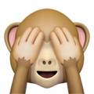

<!-- PROJECT LOGO -->
 

  

  <h2 align="center">Youtube Studio Video Performance Hider</h2>
  
<em>snappy!</em>

## A simple extension for Google Chrome that allows people to toggle hiding and displaying their latest video analytics page.

  

### This project was started in response to a video posted by Super Eyepatch Wolf in which a number of YouTube authors express their dissatisfaction and anxiety faced when their analytics are the first thing to be presented with upon opening YouTube Studio.

### *I understand there may be some hesitency with using this extension in your YouTube Studio account, hence why I've made it open-source so it can be held to high-scrutiny. Ultimately this project was started to help people so if you have any suggestions or changes you'd like to see please let me know in `issues` or open a PR :)*